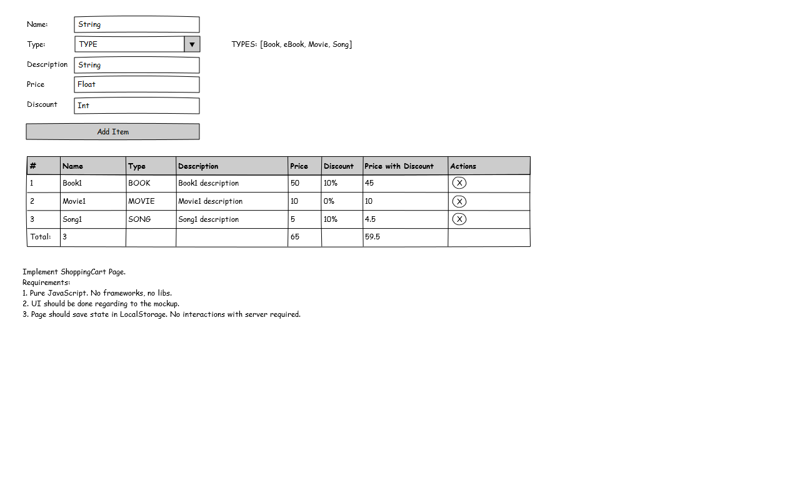

# shopping-cart
Vanilla JavaScript Shopping Cart Example.

## Local setup

- Install the dependencies with `npm install`
- Run tests `npm test`
- Start with `npm run start` (http://localhost:5000)
- Generate documentation `npm run doc`
